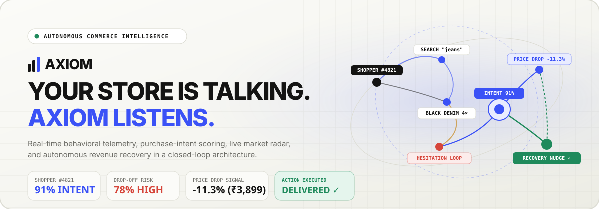
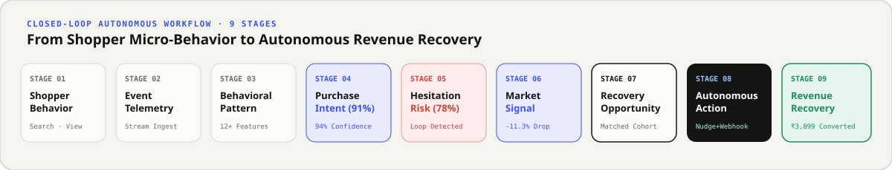
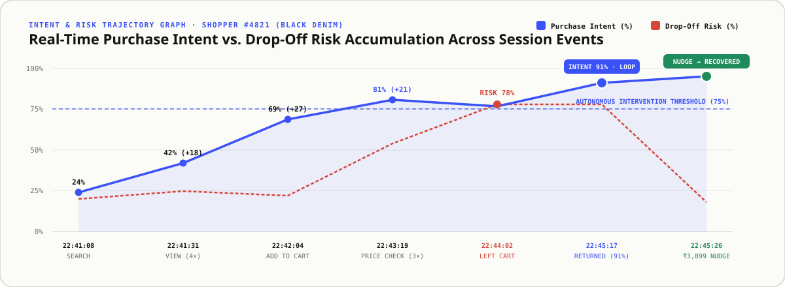
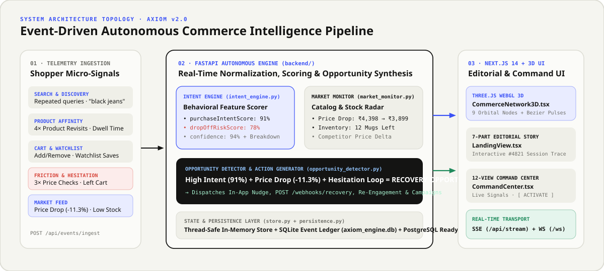

<div align="center">



# AXIOM — Autonomous E-Commerce Intent & Revenue Recovery Engine

**YOUR STORE IS TALKING. AXIOM LISTENS.**

[](https://nextjs.org/)
[](https://www.typescriptlang.org/)
[](https://tailwindcss.com/)
[](https://threejs.org/)
[](https://fastapi.tiangolo.com/)

**[Architecture Specification](docs/ARCHITECTURE.md)** · **[Operational Workflow Guide](docs/WORKFLOW.md)** · **[Technology Stack](STACK.md)**

</div>

---

## Overview

**Axiom** is not a passive analytics dashboard, a generic CRM, or a static collection of KPI cards.

Axiom is an **autonomous commerce intelligence system** that sits between your storefront and your revenue. It observes granular shopper micro-behaviors in real time, synthesizes purchase intent and hesitation risk, monitors live catalog/market shifts (price drops, inventory depletion, competitor moves), detects high-value recovery opportunities, and dispatches autonomous actions (`In-App Nudges`, `POST /webhooks/recovery`, `Re-Engagement`, and `Cohort Campaigns`).



---

## The Flagship Story: Shopper `#4821` on *Black Denim*

Every layer of Axiom reinforces a continuous real-time causal narrative:

```text
22:41:08   SEARCH                 "black jeans"
    ↓
22:41:31   PRODUCT VIEW           Black Denim / ₹4,398 (4× revisit across sessions)
    ↓
22:42:04   ADDED TO CART          Size 32 · Slim Tapered (₹4,398)
    ↓
22:43:19   PRICE CHECK            3× price & shipping inspection without checkout
    ↓
22:44:02   LEFT CART              Checkout stalled · Drop-off risk spikes to 78%
    ↓
22:45:17   RETURNED               Shopper returns to Black Denim product page
    ↓
22:45:19   AXIOM ENGINE           HESITATION LOOP DETECTED
                                  • Purchase Intent: 91% (Confidence: 94%)
                                  • Drop-Off Risk:   78%
                                  • Signals:         +27 Cart · +21 Price Checks · +18 Views · +14 Return · +11 Hesitation
    ↓
MARKET     PRICE DROP DETECTED    Black Denim: ₹4,398 → ₹3,899 (-11.3% / -₹499)
    ↓
OPPORTUNITY SYNTHESIZED           HIGH INTENT + PRICE DROP (23 shoppers · ₹89,677 recoverable)
    ↓
AUTONOMOUS ACTION EXECUTED        In-App Nudge: "Black Denim is now ₹3,899." + POST /webhooks/recovery
    ↓
REVENUE RECOVERED                 Checkout resumed · ₹3,899 order converted
```



---

## System Architecture



### 1. Autonomous Backend Engine (`backend/`)
Built with **FastAPI**, **Pydantic v2**, **AsyncIO**, and **SQLite/SQLAlchemy persistence**:
1. **Event Ingestion & Normalization** (`POST /api/events/ingest` + `backend/simulation.py`): Normalizes raw storefront telemetry (`search`, `product_view`, `add_to_cart`, `remove_from_cart`, `price_check`, `wishlist_add`, `checkout_start`, `cart_abandon`, `return_visit`, `product_compare`, `hesitation_detected`).
2. **Shopper & Session Aggregation** (`backend/store.py`): Tracks per-shopper active carts, watchlists, revisit counts, dwell duration, and hesitation loops across 64 seeded shoppers and 12 catalog products.
3. **Purchase-Intent & Risk Scoring Engine** (`backend/intent_engine.py`): Computes `purchaseIntentScore`, `dropOffRiskScore`, `confidence`, `signalBreakdown`, and `predictedNextAction`.
4. **Live Market Monitor** (`backend/market_monitor.py`): Watches product price changes, low-stock thresholds, flash discounts, and competitor pricing shifts (`POST /api/market-events/simulate`).
5. **Opportunity Detector & Autonomous Dispatcher** (`backend/opportunity_detector.py`): Connects high shopper intent with market signals and executes recovery actions (`POST /api/opportunities/{id}/activate`).
6. **Persistent Event History** (`backend/persistence.py`): Persists events, market shifts, and actions to `backend/axiom_engine.db` while streaming live updates over **Server-Sent Events (`/api/stream`)** and **WebSockets (`/ws`)**.

### 2. Next.js 14 + TypeScript + Tailwind CSS + Three.js Frontend (`src/`)
- **Interactive 3D Commerce Signal Network** ([`src/components/three/CommerceNetwork3D.tsx`](src/components/three/CommerceNetwork3D.tsx)): Real-time Three.js WebGL scene featuring 9 orbital nodes (`SHOPPER #4821`, `SEARCH`, `PRODUCT`, `WATCHLIST`, `CART`, `HESITATION`, `INTENT 91%`, `MARKET EVENT`, `RECOVERY`), 3D Cubic Bezier connections, animated signal packets, and projected 2D glass telemetry pills.
- **7-Section Editorial Story Landing Page** ([`src/components/landing/LandingView.tsx`](src/components/landing/LandingView.tsx)):
  - `Section 01`: *The Store Is Talking* (Interactive trace of Shopper `#4821`)
  - `Section 02`: *Axiom Sees What Ordinary Analytics Miss* (16 granular micro-behaviors)
  - `Section 03`: *Behavior Becomes Intent* (`91% Intent`, `78% Risk`, `94% Confidence`, signal breakdown bars)
  - `Section 04`: *Then The Market Changes* (`₹4,398 → ₹3,899` price drop radar)
  - `Section 05`: *Axiom Connects The Dots* (`High Intent + Price Drop + Abandoned Cart = Recovery Opportunity`)
  - `Section 06`: *Axiom Acts* (`In-App Nudge`, `POST /webhooks/recovery`, `Re-Engagement`, `Campaign`)
  - `Section 07`: *The Result: Recoverable Revenue*
- **12-Section Enterprise Command Center** ([`src/components/workspace/CommandCenter.tsx`](src/components/workspace/CommandCenter.tsx)):
  1. **Overview**: Live telemetry stream, 3D network topology, active opportunities, intent distribution, and recent autonomous actions.
  2. **Live Signals**: Real-time event stream with category filters and an interactive **Emit Live Signal** bar.
  3. **Shoppers**: Directory + rich **Shopper Behavioral Timeline**, signal contribution bars, predicted next action, matched opportunities, and delivered actions.
  4. **Products**: Catalog intelligence (`Black Denim`, `Ceramic Mug Set`, `Studio Monitor Headphones`, `Terra Runner Sneakers`, `Cellular Barrier Serum`, `Nordic White Oak Coffee Table`, etc.) with 1-click price drop simulation.
  5. **Intent Engine**: Interactive **What-If Behavioral Signal Scorer** sandbox.
  6. **Opportunities**: Actionable recovery cards (`HIGH INTENT + PRICE DROP`, `INVENTORY PRESSURE`, `HESITATION LOOP`) with live **`[ ACTIVATE ]`** buttons.
  7. **Market Monitor**: Live catalog & stock radar with custom price-drop and low-stock triggers.
  8. **Actions**: Ledger of autonomous nudges, webhooks, and conversions.
  9. **Campaigns**: Multi-step autonomous playbooks with live status toggles.
  10. **Webhooks**: Live `POST /webhooks/recovery` payload inspector and test dispatcher.
  11. **Analytics**: Closed-loop conversion lift and category intent density.
  12. **Settings**: Autonomous intent/risk policy thresholds and adapter health status.

---

## Project Structure

```text
Axiom/
├── backend/                        # FastAPI Autonomous Commerce Engine
│   ├── config.py                   # Environment-driven settings & cadence intervals
│   ├── engine.py                   # AsyncIO background loop orchestrator + WS/SSE broadcaster
│   ├── intent_engine.py            # Behavioral feature extraction & intent/risk scoring
│   ├── main.py                     # FastAPI routes (/api/*), SSE (/api/stream), WebSocket (/ws)
│   ├── market_monitor.py           # Price drop, inventory depletion & competitor monitor
│   ├── models.py                   # Pydantic v2 domain models
│   ├── opportunity_detector.py     # Opportunity synthesis & autonomous action dispatcher
│   ├── persistence.py              # SQLite event & action ledger (axiom_engine.db)
│   ├── seed_data.py                # Flagship products, shoppers (#4821), opportunities & actions
│   ├── simulation.py               # Realistic shopper micro-behavior telemetry generator
│   └── store.py                    # Thread-safe in-memory state store
├── src/                            # Next.js 14 + TypeScript + Tailwind CSS Frontend
│   ├── app/
│   │   ├── globals.css             # Editorial warm light-mode tokens & base styles
│   │   ├── layout.tsx              # Space Grotesk, DM Sans & DM Mono typography setup
│   │   └── page.tsx                # Live state hydration, SSE stream client & mode controller
│   ├── components/
│   │   ├── three/
│   │   │   └── CommerceNetwork3D.tsx # Three.js WebGL 3D Commerce Signal Network
│   │   ├── landing/
│   │   │   └── LandingView.tsx     # 7-Section Editorial Product Story
│   │   └── workspace/
│   │       └── CommandCenter.tsx   # 12-View Enterprise Command Center
│   ├── lib/
│   │   └── api.ts                  # Typed API client & canonical initial snapshot
│   └── types/
│       └── axiom.ts                # End-to-end TypeScript interfaces
├── docs/                           # Architecture & Workflow Documentation
│   ├── ARCHITECTURE.md             # Deep engineering & mathematical specification
│   ├── WORKFLOW.md                 # 9-stage operational & developer workflow guide
│   └── assets/                     # Embedded SVG architecture graphs & charts
├── .env.example                    # Safe environment variable template
├── .gitignore                      # Excludes .env, node_modules, .next, __pycache__, *.db
├── next.config.mjs                 # Next.js config with /api/* proxy rewrites to FastAPI
├── package.json                    # Frontend dependencies & scripts
├── requirements.txt                # Python backend dependencies
├── STACK.md                        # Complete technology stack reference
└── tailwind.config.ts              # Editorial color & typography tokens
```

---

## Quick Start

### 1. Environment Setup
Copy the safe environment template:
```bash
cp .env.example .env
```

### 2. Start the FastAPI Autonomous Engine (Port `8000`)
```bash
pip install -r requirements.txt
python -m uvicorn backend.main:app --host 127.0.0.1 --port 8000 --reload
```

### 3. Start the Next.js Application (Port `3000`)
In a second terminal:
```bash
npm install
npm run dev
```
Open **[http://localhost:3000](http://localhost:3000)** in your browser. Next.js automatically proxies `/api/*` requests to the FastAPI engine on port `8000`.

---

## REST & Real-Time API Reference

| Method | Endpoint | Description |
| :---: | :--- | :--- |
| `GET` | `/api/health` | Engine status, version, SQLite persistence count, and active entity counts |
| `GET` | `/api/snapshot` | Complete live state snapshot (`stats`, `events`, `shoppers`, `products`, `opportunities`, `market_events`, `actions`, `campaigns`, `webhooks`) |
| `GET` | `/api/stream` | **Server-Sent Events (SSE)** real-time stream of engine broadcasts |
| `WS` | `/ws` | **WebSocket** bi-directional real-time stream |
| `GET` | `/api/events` | Chronological shopper telemetry stream (`?limit=60&shopper_id=...`) |
| `POST` | `/api/events/ingest` | Ingest a live shopper micro-behavior event and trigger instant intent re-scoring |
| `GET` | `/api/shoppers` | Active shoppers sorted by `intent`, `risk`, or `recent` |
| `GET` | `/api/shoppers/{id}` | Full shopper behavioral timeline, signal breakdown, opportunities, and actions |
| `GET` | `/api/products` | Catalog products enriched with `high_intent_shoppers` and `intent_density` |
| `GET` | `/api/opportunities` | Active revenue recovery opportunities |
| `POST` | `/api/opportunities/{id}/activate` | Execute autonomous recovery actions & webhooks for an opportunity |
| `GET` | `/api/market-events` | Live price drops, low-stock alerts, and competitor price shifts |
| `POST` | `/api/market-events/simulate` | Simulate a live price drop or low-stock signal on any catalog product |
| `GET` | `/api/actions` | Executed autonomous recovery actions ledger |
| `GET` | `/api/campaigns` | Autonomous recovery campaigns and conversion metrics |
| `POST` | `/api/campaigns/{id}/toggle` | Toggle a campaign between `active` and `paused` |
| `GET` | `/api/webhooks` | Webhook outbox delivery logs (`POST /webhooks/recovery`) |
| `POST` | `/api/webhooks/test` | Dispatch a signed test webhook payload |