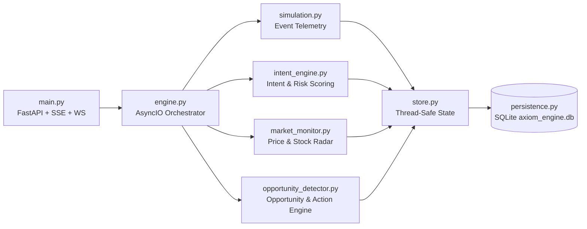

# AXIOM — Technology Stack & System Reference (v2.0)

---

## 1. Executive Stack Overview

**Axiom** is a full-stack autonomous e-commerce intent and revenue recovery engine built with a decoupled, real-time event-driven architecture:

| Layer | Technology | Version | Role in Axiom |
| :--- | :--- | :--- | :--- |
| **Frontend Framework** | **Next.js (App Router)** | `14.2.18` | Server/Client hybrid rendering, routing, and `/api/*` proxy rewrites |
| **Language (UI)** | **TypeScript** | `5.6.3` | Strict end-to-end domain typing (`src/types/axiom.ts`) |
| **Styling & Design System** | **Tailwind CSS** | `3.4.15` | Warm off-white editorial palette (`#F5F5F0`, `#FBFBF8`, `#3B52F6`, `#141413`) |
| **3D Visualization** | **Three.js (WebGL)** | `0.170.0` | Interactive 3D Commerce Signal Network (`CommerceNetwork3D.tsx`) |
| **Motion & Transitions** | **Framer Motion** | `11.11.17` | Deliberate state transitions, live stream animations, and timeline progression |
| **Iconography & UI** | **Lucide React** | `0.460.0` | Crisp technical iconography across the 12 Command Center views |
| **Backend API Framework** | **FastAPI + Uvicorn** | `Latest` | High-throughput REST API, Server-Sent Events (`/api/stream`), and WebSockets (`/ws`) |
| **Autonomous Engine** | **Python AsyncIO** | `3.11+` | 5 concurrent background loops (events, intent, market, opportunities, stats) |
| **Data Validation** | **Pydantic v2** | `Latest` | Strict serialization and validation for all telemetry events and actions |
| **Persistence Layer** | **SQLite + SQLAlchemy** | Built-in | Zero-config persistent event ledger (`backend/axiom_engine.db`) + PostgreSQL ready |

---

## 2. Backend Module Responsibilities (`backend/`)

| File | Responsibility |
| :--- | :--- |
| [`backend/main.py`](backend/main.py) | FastAPI application entrypoint, lifecycle management, REST routes (`/api/*`), SSE (`/api/stream`), and WebSocket (`/ws`) endpoints |
| [`backend/engine.py`](backend/engine.py) | `AxiomEngine` orchestrator managing 5 concurrent `asyncio` loops and broadcasting real-time frames to all connected clients |
| [`backend/models.py`](backend/models.py) | Canonical Pydantic models: `Product`, `Shopper`, `ShopperEvent`, `IntentScore`, `MarketEvent`, `Opportunity`, `RecoveryAction`, `Campaign`, `WebhookDelivery`, `DashboardStats` |
| [`backend/intent_engine.py`](backend/intent_engine.py) | Behavioral feature extraction & heuristic/ML-ready scoring producing `purchaseIntentScore`, `dropOffRiskScore`, `confidence`, `signalBreakdown`, and `predictedNextAction` |
| [`backend/market_monitor.py`](backend/market_monitor.py) | Tracks catalog price drops, low-inventory thresholds, flash discounts, and competitor pricing shifts |
| [`backend/opportunity_detector.py`](backend/opportunity_detector.py) | Cross-references high-intent shoppers with market shifts and hesitation loops to generate `Opportunity` records and execute `RecoveryAction` + `WebhookDelivery` dispatches |
| [`backend/simulation.py`](backend/simulation.py) | Realistic shopper micro-behavior telemetry generator (cleanly separated from `POST /api/events/ingest`) |
| [`backend/seed_data.py`](backend/seed_data.py) | Seeds 12 flagship products (`Black Denim`, `Ceramic Mug Set`, `Studio Monitor Headphones`, etc.), 64 realistic shoppers (including `#4821`), historical events, opportunities, campaigns, and webhooks |
| [`backend/store.py`](backend/store.py) | Thread-safe `RLock` in-memory state store synchronized with SQLite persistence |
| [`backend/persistence.py`](backend/persistence.py) | SQLite persistence adapter (`backend/axiom_engine.db`) storing `events_log`, `actions_log`, and `market_events_log` |
| [`backend/config.py`](backend/config.py) | Environment-driven configuration loaded via `python-dotenv` |

---

## 3. Frontend Architecture (`src/`)

| File | Responsibility |
| :--- | :--- |
| [`src/app/layout.tsx`](src/app/layout.tsx) | Root layout loading Google Fonts (`Space Grotesk`, `DM Sans`, `DM Mono`) and global editorial styles |
| [`src/app/page.tsx`](src/app/page.tsx) | Main application controller managing real-time synchronization (`/api/snapshot` + `/api/stream` SSE) and switching between the Editorial Landing Page and the 12-view Command Center |
| [`src/components/three/CommerceNetwork3D.tsx`](src/components/three/CommerceNetwork3D.tsx) | Interactive Three.js WebGL 3D Commerce Signal Network with 9 orbital nodes, curved 3D Bezier splines, animated signal packets, and projected 2D glass telemetry pills |
| [`src/components/landing/LandingView.tsx`](src/components/landing/LandingView.tsx) | 7-Section Editorial Product Story (*The Store Is Talking*, *Micro-Behaviors*, *Behavior Becomes Intent*, *Then The Market Changes*, *Axiom Connects The Dots*, *Axiom Acts*, *Recoverable Revenue*) |
| [`src/components/workspace/CommandCenter.tsx`](src/components/workspace/CommandCenter.tsx) | Complete 12-section enterprise application (`Overview`, `Live Signals`, `Shoppers`, `Products`, `Intent Engine`, `Opportunities`, `Market Monitor`, `Actions`, `Campaigns`, `Webhooks`, `Analytics`, `Settings`) |
| [`src/lib/api.ts`](src/lib/api.ts) | Typed REST & real-time client with instant initial hydration snapshot (`INITIAL_SNAPSHOT`) and INR currency/time formatters |
| [`src/types/axiom.ts`](src/types/axiom.ts) | Full TypeScript interfaces mirroring the FastAPI Pydantic models |

---

## 4. Design System Tokens

| Token | Hex | Usage |
| :--- | :--- | :--- |
| `axiom-bg` | `#F5F5F0` | Primary warm editorial background |
| `axiom-paper` | `#FBFBF8` | Elevated surface cards and panels |
| `axiom-surface` | `#EFEFE8` | Secondary recessed containers and pills |
| `axiom-ink` | `#141413` | Primary typography and high-contrast CTAs |
| `axiom-muted` | `#6E6E68` | Secondary editorial copy and timestamps |
| `axiom-line` | `#DCDCD3` | Crisp structural borders |
| `axiom-blue` | `#3B52F6` | Primary intelligence & intent accent |
| `axiom-green` | `#1F8A5C` | Autonomous action execution & recovered revenue |
| `axiom-red` | `#D6453A` | Drop-off risk, cart abandonment & hesitation loops |