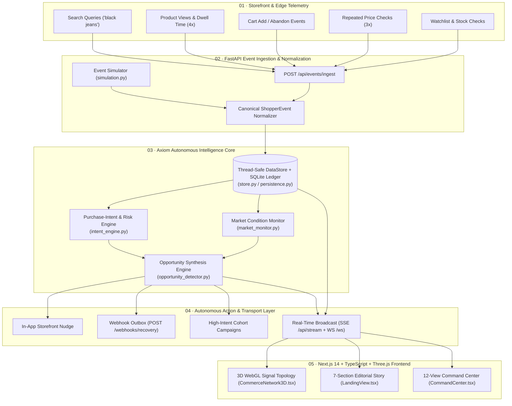
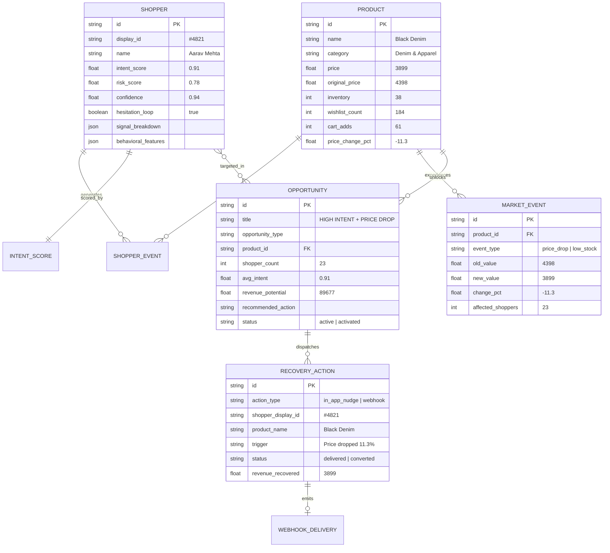

# AXIOM — System Architecture & Engineering Specification

---

## 1. Architectural Philosophy

**Axiom** is designed as an **event-driven, closed-loop autonomous commerce intelligence engine** rather than a passive reporting dashboard. Every layer of the stack is engineered around sub-second progression from **granular shopper telemetry** to **autonomous revenue recovery**.

---

## 2. Intent Scoring & Drop-Off Risk Mathematics

Axiom's [`IntentEngine`](../backend/intent_engine.py) extracts 12+ behavioral features per active shopper session and computes four primary outputs:

1. **`purchaseIntentScore` ($\in [0, 1]$)**:
   $$\text{Intent}(s) = \text{clip}\left(\frac{1}{100}\sum_{k \in \mathcal{S}} w_k \cdot \phi_k(s) \cdot \gamma(\Delta t_k),\; 0.18,\; 0.97\right)$$
   where $\phi_k(s)$ represents normalized behavioral signal intensity, $w_k$ is the signal weight, and $\gamma(\Delta t_k)$ is the recency decay factor.

2. **`dropOffRiskScore` ($\in [0, 1]$)**:
   $$\text{Risk}(s) = \text{clip}\left(r_0 + 0.22 \cdot \mathbb{I}_{\text{abandon}} + \min(0.24,\; 0.06 \cdot n_{\text{price\_check}}) + 0.12 \cdot \mathbb{I}_{\text{hesitation\_loop}},\; 0.15,\; 0.92\right)$$

3. **`hesitationLoopDetected` ($\in \{\text{true}, \text{false}\}$)**:
   Triggered when a shopper exhibits high product affinity alongside price friction:
   $$\text{HesitationLoop}(s) \iff \left(n_{\text{views}} \ge 3 \land n_{\text{cart}} \ge 1 \land n_{\text{price\_check}} \ge 2 \land n_{\text{return\_sessions}} \ge 1\right)$$

4. **`signalBreakdown`**:
   An interpretable dictionary mapping each behavioral driver to its exact point contribution:

| Behavioral Signal | Code | Max Contribution |Shopper `#4821` Example |
| :--- | :--- | :---: | :---: |
| **Added to cart** | `SIG_CART` | `+30.0` | **`+27.0`** |
| **Price checks** | `SIG_PRICE` | `+24.0` | **`+21.0`** |
| **Repeated product views** | `SIG_VIEW` | `+26.0` | **`+18.0`** |
| **Returned session** | `SIG_RETURN` | `+18.0` | **`+14.0`** |
| **Checkout hesitation** | `SIG_HESITATE` | `+15.0` | **`+11.0`** |
| **Total Accumulated Score** | — | `100.0` | **`91% Intent` / `78% Risk` / `94% Confidence`** |

---

## 3. Data Model & Entity Relationships

---

## 4. 3D WebGL Commerce Signal Network Pipeline

The [`CommerceNetwork3D.tsx`](../src/components/three/CommerceNetwork3D.tsx) component visualizes the invisible signal graph underneath the store using a hybrid **Three.js WebGL + Projected 2D Telemetry Overlay** pipeline:

1. **WebGL Scene Graph (`THREE.Scene`)**:
   - **Orbital Rings**: Dual counter-rotating `THREE.RingGeometry` meshes establish spatial depth.
   - **3D Semantic Nodes**: 9 `THREE.SphereGeometry` + halo ring groups positioned in 3D coordinates (`SHOPPER #4821`, `SEARCH`, `PRODUCT`, `WATCHLIST`, `CART`, `HESITATION`, `INTENT 91%`, `MARKET EVENT`, `RECOVERY`).
   - **Curved 3D Filaments**: 12 `THREE.CubicBezierCurve3` splines connecting causal stages.
   - **Animated Signal Packets**: High-frequency `THREE.Mesh` spheres traversing each 3D Bezier curve at variable velocities (`t * speed + offset mod 1`).
2. **3D-to-2D Frustum Projection**:
   - On every animation frame, each 3D node's world position $\mathbf{p} \in \mathbb{R}^3$ is projected through the `THREE.PerspectiveCamera` matrix (`worldPos.project(camera)`).
   - Normalized device coordinates $(x_{\text{ndc}}, y_{\text{ndc}}) \in [-1, 1]^2$ map to pixel coordinates:
     $$x_{\text{screen}} = \left(\frac{x_{\text{ndc}} + 1}{2}\right) W, \qquad y_{\text{screen}} = \left(\frac{1 - y_{\text{ndc}}}{2}\right) H$$
   - Interactive glass telemetry pills anchor to $(x_{\text{screen}}, y_{\text{screen}})$, providing crisp typography with true 3D parallax.
