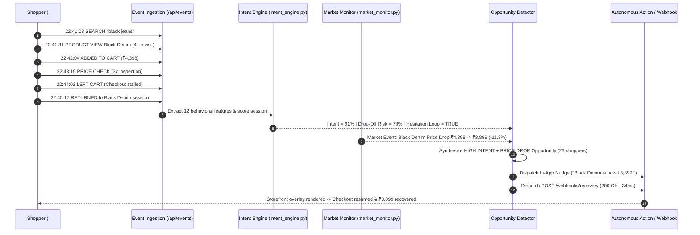

# AXIOM — Operational & Developer Workflow Guide

---

## 1. The 9-Stage Autonomous Product Loop

Every screen, background worker, and API endpoint in Axiom executes a single continuous 9-stage operational workflow:

---

## 2. Interactive Operator Workflows in the Command Center

### Workflow A: Simulating Live Shopper Micro-Behaviors
1. Open the Command Center and select **Live Signals** in the left navigation.
2. In the **Simulate Real-Time Shopper Micro-Behavior** bar at the top:
   - Choose a target shopper (e.g., `#4821 · Aarav Mehta (91%)` or `#7719 · Rohan Kapoor (84%)`).
   - Select an event type (`SEARCH`, `PRODUCT VIEW`, `ADD TO CART`, `PRICE CHECK`, `LEFT CART`, `RETURNED SESSION`, or `HESITATION LOOP`).
   - Select a catalog product (e.g., `Black Denim (₹3,899)` or `Ceramic Mug Set (₹2,499)`).
   - Click **Emit Live Signal**.
3. **What happens under the hood**:
   - Sends `POST /api/events/ingest` to FastAPI.
   - Persists the event to `backend/axiom_engine.db` (`events_log` table).
   - Re-scores the shopper's `purchaseIntentScore`, `dropOffRiskScore`, and `signalBreakdown`.
   - Broadcasts `shopper_event` over Server-Sent Events (`/api/stream`) and WebSockets (`/ws`).

---

### Workflow B: Injecting a Live Market Signal (Price Drop / Low Stock)
1. Navigate to **Market Monitor** (or **Products**).
2. Select any product in the **Inject Price Movement or Inventory Pressure Signal** bar.
3. Click **Trigger Price Drop (-11%)** or **Trigger Low Stock Alert**.
4. **What happens under the hood**:
   - Calls `POST /api/market-events/simulate`.
   - Updates the product's live price or inventory count and appends to `price_history`.
   - Immediately invokes `opportunity_detector.detect_opportunities()` to cross-reference active high-intent shoppers watching that product.
   - Creates a new `Opportunity` and dispatches autonomous `RecoveryAction` records.

---

### Workflow C: Activating a Revenue Recovery Opportunity (`[ ACTIVATE ]`)
1. Navigate to **Opportunities** (or the **Overview** dashboard).
2. Inspect an active opportunity card, such as:
   - **`HIGH INTENT + PRICE DROP` · `Black Denim`** (`23 shoppers` · `91% average intent` · `₹499 price reduction`)
   - **`INVENTORY PRESSURE` · `Ceramic Mug Set`** (`12 remaining` · `327 watchlist` · `41 high-intent`)
3. Click **`[ ACTIVATE ]`**.
4. **What happens under the hood**:
   - Calls `POST /api/opportunities/{opportunity_id}/activate`.
   - Generates targeted `RecoveryAction` entries (`In-app price-drop nudge`, `POST /webhooks/recovery`).
   - Logs signed JSON webhook deliveries in the **Webhooks** outbox (`200 OK`).
   - Increments `recovered_revenue` and `actions_triggered` across the workspace in real time.

---

## 3. Connecting Real Production Adapters

Axiom cleanly separates simulation generators from core scoring and persistence so production adapters can be connected with zero UI changes:

| Subsystem | Simulation / Local Module | Production Drop-In Replacement |
| :--- | :--- | :--- |
| **Event Ingestion** | [`backend/simulation.py`](../backend/simulation.py) | Browser JS SDK / Segment / RudderStack / Kafka consumer posting to `POST /api/events/ingest` |
| **Persistence** | [`backend/persistence.py`](../backend/persistence.py) (SQLite) | PostgreSQL (`SQLAlchemy` via `DB_HOST` in `.env`) + Redis session store |
| **Intent Scoring** | [`backend/intent_engine.py`](../backend/intent_engine.py) | XGBoost / PyTorch / ONNX inference inside `IntentEngine.score_shopper()` |
| **Market Monitor** | [`backend/market_monitor.py`](../backend/market_monitor.py) | Shopify / Medusa / ERP webhook listeners for price & inventory mutations |
| **Action Outbox** | [`backend/opportunity_detector.py`](../backend/opportunity_detector.py) | Klaviyo, Braze, Twilio SMS, or storefront WebSocket overlay |
